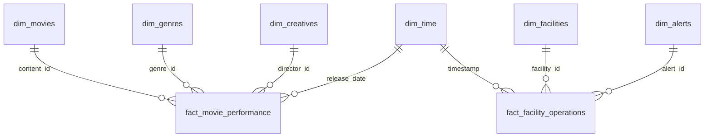

# 📊 Enterprise Power BI Blueprint & Semantic Model Guide
> **System Architecture:** Dual-Domain Star Schema Relational Analytics  
> **Compatibility:** Microsoft Power BI Desktop (May 2024+), Power BI Service, Fabric Lakehouse  
> **Direct Integration:** PostgreSQL Warehouse / Parquet / Processed CSV Pipeline

---

## 1. 🌟 Star Schema Semantic Relational Architecture

The system is architected as an enterprise dimensional model adhering to Ralph Kimball principles:

### Table Relationships & Cardinality:
- **`dim_movies` (1) ➔ `fact_movie_performance` (∞)**: Join on `content_id` (Cross-filter: Single / Both)
- **`dim_genres` (1) ➔ `fact_movie_performance` (∞)**: Join on `genre_id` (Cross-filter: Single)
- **`dim_facilities` (1) ➔ `fact_facility_operations` (∞)**: Join on `facility_id` (Cross-filter: Single)
- **`dim_time` (1) ➔ `fact_facility_operations` (∞)**: Join on `date_key` (Marked as Official Date Table)

---

## 2. 📑 Recommended 4-Page Power BI Report Blueprint

### Page 1: Executive KPI Command Center & Target Gauges
- **Header**: Domain Matrix Banner with Data Quality Index (DQI) badge (99.7% A+ Pristine).
- **KPI Gauge Cards**:
  - Media: Portfolio ROI % vs 150% Hurdle Rate | Gross Contribution Margin % | Platform Watch Hours.
  - Industrial: Water-to-Energy Ratio (WER) vs Target KPI | Discharge Quality Score | Volumetric Savings.
- **Top Slicers**: Domain Switcher, Timeframe Range Slider, Sector / Genre Dropdown, Decision Category.

### Page 2: Financial & Operational Waterfall Reconciliation Bridge
- **Visual**: Native Power BI Waterfall Chart (`Waterfall visual`).
  - **CineMetrics Bridge**: `[Total Gross Revenue]` ➔ `-[Total Production Budget]` ➔ `-[Total Marketing Spend]` ➔ `-[Total Licensing Overhead]` ➔ `=[Net Contribution Profit]`.
  - **EcoMetrics Bridge**: `[Total Water Treated m³]` ➔ `-[Evaporative Loss m³]` ➔ `-[Blowdown Sludge m³]` ➔ `+[Closed-Loop Recycled m³]` ➔ `=[Net Compliant Effluent m³]`.
- **Significance**: Delivers complete variance reconciliation from top-line inflow to bottom-line margin.

### Page 3: Decomposition Tree (Root-Cause Driver Analysis)
- **Visual**: Native Power BI Decomposition Tree (`Decomposition Tree visual`).
  - **Analyze**: `[Total Gross Revenue]` or `[Total Water Treated (Liters)]`.
  - **Explain By**:
    - Media: `dim_genres[genre_name]` ➔ `dim_movies[content_type]` ➔ `fact_movie_performance[decision]` ➔ `dim_movies[title]`.
    - Industrial: `dim_facilities[industry_type]` ➔ `dim_facilities[facility_name]` ➔ `fact_facility_operations[shift_id]` ➔ `fact_facility_operations[anomaly_category]`.
- **Capability**: Enables C-suite executives to perform AI-driven drilldowns to identify highest-performing assets or root causes of sensor breaches.

### Page 4: Interactive Matrix Grid & In-Cell Conditional Formatting
- **Visual**: Matrix Visual with In-Cell Data Bars & SVG Sparklines.
  - Media: Title Ranking Matrix with conditional ROI badges (Green: >150%, Yellow: 0-150%, Red: <0%).
  - Industrial: Facility Operations Matrix with Water-Energy Efficiency variance and Active Excursion counts.

---

## 3. ⚙️ Step-by-Step Power BI Desktop Import Guide

1. **Launch Power BI Desktop** ➔ Select **Get Data** ➔ **Folder / CSV / PostgreSQL**.
2. **Point to Data Pipeline Directory**:
   - Media: Ingest `data/analytics/content_performance_scorecard.csv`.
   - Industrial: Ingest `industrial_raw_factory_logs.csv` (or modeled Star Schema tables).
3. **Open Power Query (Transform Data)**:
   - Verify data types: Timestamps (`DateTime`), IDs (`Int64` / `Text`), Financials (`Fixed Decimal Number $`).
4. **Load & Establish Star Schema Relationships** in Model View.
5. **Import DAX Measures**:
   - Right-click table ➔ **New Measure** ➔ Paste formulas from:
     - [`powerbi/CPIP_Entertainment_Measures.dax`](./CPIP_Entertainment_Measures.dax)
     - [`powerbi/EcoMetrics_Industrial_Measures.dax`](./EcoMetrics_Industrial_Measures.dax)
